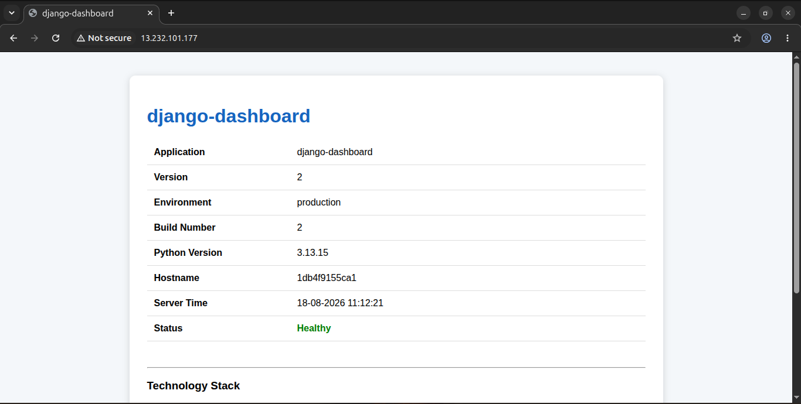
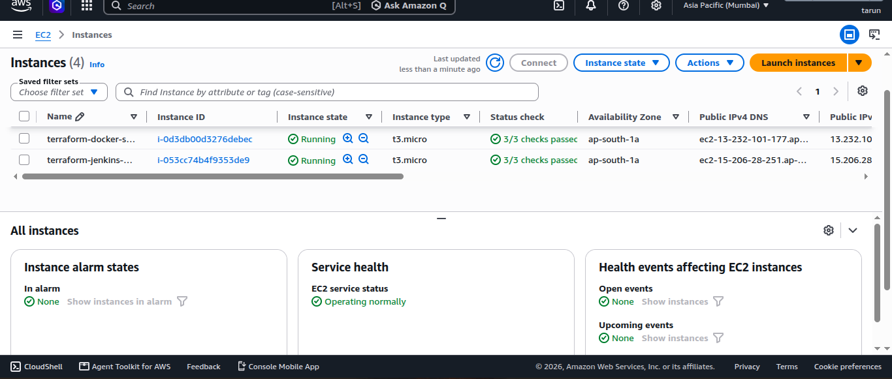
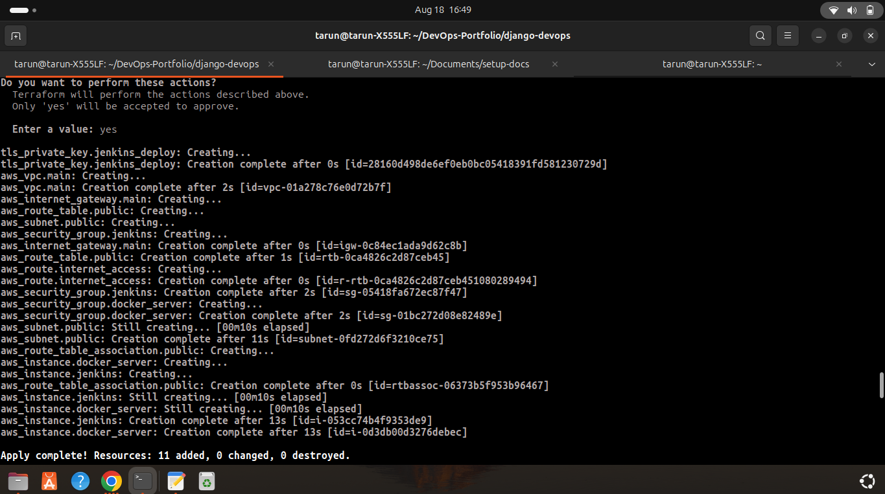
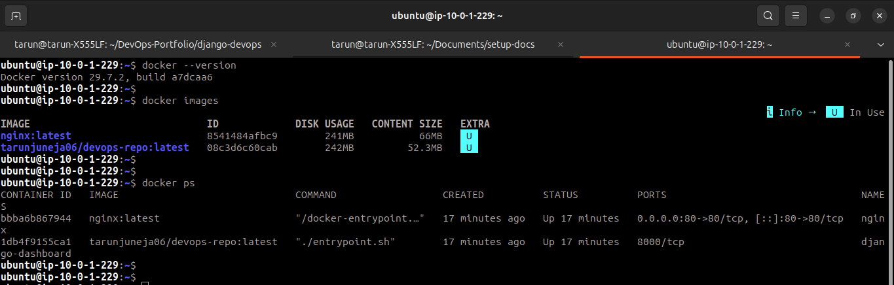
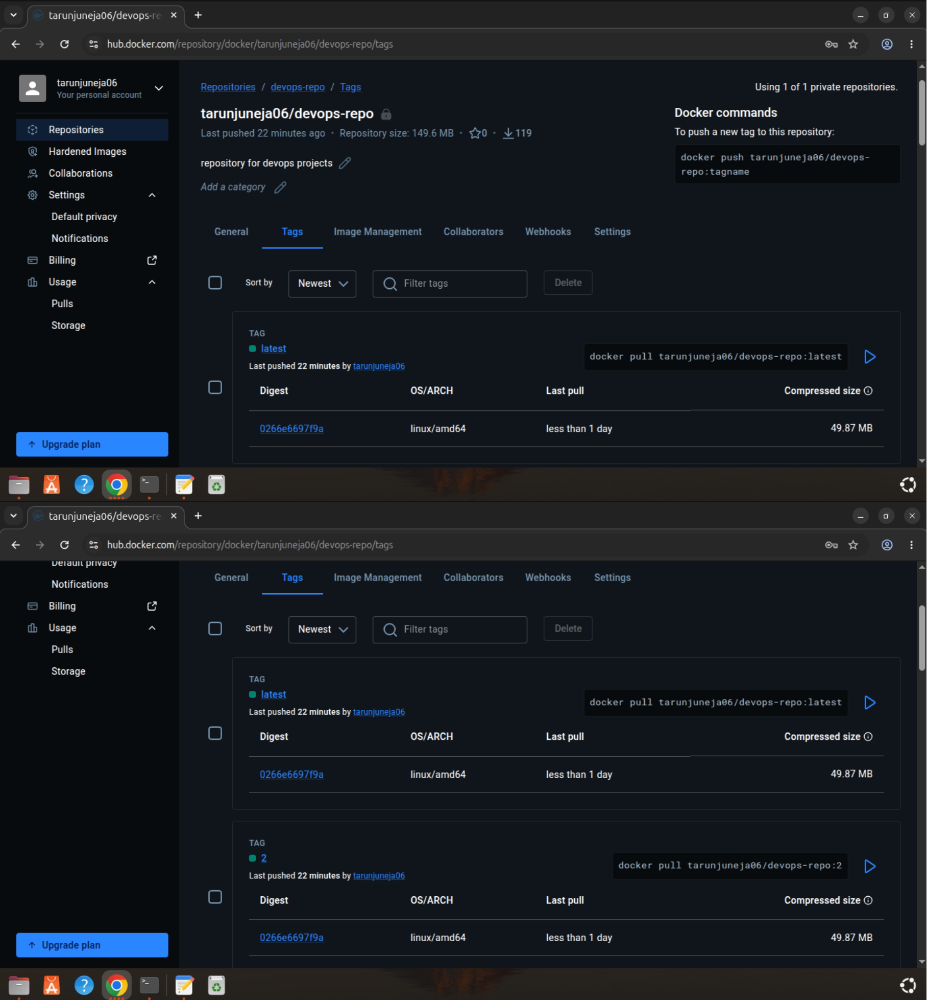

# Django DevOps CI/CD on AWS

A production-style **Django application deployment on AWS** demonstrating Infrastructure as Code with Terraform, containerization with Docker, CI/CD automation with Jenkins, Docker image management with Docker Hub, automated SSH deployment, and AWS infrastructure provisioning.

The project provisions the required AWS infrastructure using Terraform and implements an automated CI/CD workflow from GitHub to a Docker-based application server.

---

## 🚀 Project Highlights

* Provisioned AWS infrastructure using **Terraform**
* Created a custom AWS **VPC, subnet, route table, Internet Gateway, and security groups**
* Provisioned separate EC2 instances for **Jenkins** and the **Docker application server**
* Containerized a Django application using **Docker**
* Used **Nginx + Gunicorn** for production-style application serving
* Implemented a multi-container deployment using **Docker Compose**
* Built an automated **Jenkins CI/CD pipeline**
* Built and tagged Docker images using Jenkins
* Published Docker images to **Docker Hub**
* Automated application deployment through **SSH**
* Used Jenkins Credentials for sensitive configuration
* Automated Jenkins-to-Docker-server SSH key provisioning using Terraform
* Used private VPC networking for Jenkins-to-Docker-server communication
* Implemented persistent Jenkins storage using a Docker volume
* Separated application configuration from the Docker image using environment variables
* Automated the complete infrastructure and deployment workflow

---

## 📸 Live Application

The final Django application is deployed on an AWS EC2 instance behind Nginx.

<!-- SCREENSHOT: Add your deployed Django application screenshot here -->



> **Screenshot:** Final Django application running on AWS EC2.

---

## 🏗️ Architecture

```text
                              GitHub
                                │
                                │ Source Code
                                ▼
                         ┌───────────────┐
                         │    Jenkins    │
                         │   EC2 Server  │
                         └───────┬───────┘
                                 │
                    ┌────────────┴────────────┐
                    │                         │
             Checkout Code              Build Docker Image
                    │                         │
                    │                         ▼
                    │                  ┌───────────────┐
                    │                  │   Docker Hub  │
                    │                  │ Image Registry│
                    │                  └───────┬───────┘
                    │                          │
                    │                     Pull Image
                    │                          │
                    └──────────────┐           │
                                   ▼           ▼
                            ┌──────────────────────┐
                            │   Docker EC2 Server  │
                            │                      │
                            │  ┌────────────────┐  │
                            │  │      Nginx     │  │
                            │  │      :80       │  │
                            │  └───────┬────────┘  │
                            │          │           │
                            │  ┌───────▼────────┐  │
                            │  │ Django/Gunicorn │  │
                            │  │     :8000      │  │
                            │  └────────────────┘  │
                            └──────────┬───────────┘
                                       │
                                       ▼
                                  Web Browser


                           Terraform
                               │
                  ┌────────────┴────────────┐
                  ▼                         ▼
             Jenkins EC2              Docker EC2
                  │                         │
                  └──── SSH Deployment ─────┘
```

---

## 📋 Project Overview

This project implements an automated CI/CD pipeline for a containerized Django application.

The infrastructure is provisioned using Terraform and consists of:

* AWS VPC
* Public subnet
* Internet Gateway
* Public route table
* Security groups
* Jenkins EC2 server
* Docker deployment EC2 server
* Automated SSH deployment key

The Django application is containerized and deployed using Docker Compose.

Jenkins automatically:

1. Checks out the application source code.
2. Builds the Docker image.
3. Tags the image.
4. Pushes the image to Docker Hub.
5. Connects to the Docker EC2 server using SSH.
6. Pulls the latest image.
7. Deploys the application using Docker Compose.

---

## 🛠️ Technologies Used

| Technology          | Purpose                              |
| ------------------- | ------------------------------------ |
| AWS EC2             | Compute infrastructure               |
| AWS VPC             | Network infrastructure               |
| AWS Security Groups | Network access control               |
| Terraform           | Infrastructure as Code               |
| Jenkins             | CI/CD automation                     |
| GitHub              | Source code management               |
| Docker              | Application containerization         |
| Docker Compose      | Multi-container deployment           |
| Docker Hub          | Container image registry             |
| Nginx               | Reverse proxy and static file server |
| Gunicorn            | Django WSGI application server       |
| Django              | Web application                      |
| Linux               | Server operating system              |
| SSH                 | Secure deployment communication      |

---

# ☁️ AWS Infrastructure

Terraform provisions the complete AWS infrastructure required by the project.

The infrastructure includes:

```text
VPC
│
├── Public Subnet
│
├── Internet Gateway
│
├── Route Table
│
├── Jenkins Security Group
│
├── Docker Server Security Group
│
├── Jenkins EC2
│
└── Docker EC2
```

### Network Configuration

| Resource         | Configuration  |
| ---------------- | -------------- |
| VPC              | `10.0.0.0/16`  |
| Public Subnet    | `10.0.1.0/24`  |
| Jenkins Server   | `t3.micro`     |
| Docker Server    | `t3.micro`     |
| OS               | Ubuntu         |
| Jenkins → Docker | Private VPC IP |

### 📸 AWS Infrastructure

<!-- SCREENSHOT: Add screenshot showing the EC2 instances running -->



> **Screenshot:** Jenkins and Docker EC2 instances running in AWS.

---

# 🏗️ Terraform Infrastructure

Terraform is responsible for creating the AWS infrastructure instead of requiring manual configuration through the AWS Console.

The infrastructure can be created using:

```bash
terraform init
terraform validate
terraform plan
terraform apply
```

To remove the infrastructure:

```bash
terraform destroy
```

Terraform provisions:

* VPC
* Subnet
* Internet Gateway
* Route table
* Security groups
* EC2 instances
* SSH key pair
* Required networking configuration

Terraform also generates an **ED25519 SSH key pair** using the Terraform TLS provider.

The generated private key is made available to Jenkins, while the corresponding public key is configured on the Docker server.

### 📸 Terraform Apply

<!-- SCREENSHOT: Add screenshot showing successful terraform apply -->



> **Screenshot:** Terraform successfully provisioning the AWS infrastructure.

---

# 🔐 Automated SSH Key Provisioning

One of the goals of the project was to eliminate manual SSH key configuration.

The architecture is:

```text
                  Terraform
                      │
             ┌────────┴────────┐
             │                 │
             ▼                 ▼
       Private Key        Public Key
             │                 │
             ▼                 ▼
         Jenkins          Docker Server
                              │
                       authorized_keys
```

Terraform generates the ED25519 key pair.

The private key is made available to Jenkins, while the public key is installed in:

```text
/home/ubuntu/.ssh/authorized_keys
```

Jenkins can then connect to the Docker server using SSH without manually copying keys between servers.

---

# 🔄 CI/CD Pipeline

The CI/CD pipeline is implemented using Jenkins.

The pipeline performs the following stages:

```text
GitHub
   │
   ▼
Checkout
   │
   ▼
Build Docker Image
   │
   ▼
Docker Hub Login
   │
   ▼
Push Docker Image
   │
   ▼
SSH Deployment
   │
   ▼
Docker Server
   │
   ▼
docker compose pull
   │
   ▼
docker compose up -d
```

## Pipeline Stages

### 1. Checkout

Jenkins checks out the application source code from GitHub.

### 2. Build

Jenkins builds the Docker image.

Two tags are generated:

```text
<image>:<build-number>
<image>:latest
```

For example:

```text
tarunjuneja06/devops-repo:25
tarunjuneja06/devops-repo:latest
```

### 3. Docker Hub Authentication

Jenkins authenticates with Docker Hub using Jenkins Credentials.

Credentials are not hard-coded inside the Jenkinsfile.

### 4. Push

The generated Docker images are pushed to Docker Hub.

### 5. Deploy

Jenkins connects to the Docker server using its private VPC IP address and SSH.

The deployment process:

```text
1. Create deployment directory
2. Update deployment files
3. Create deployment .env
4. Transfer .env to Docker server
5. Pull latest Docker image
6. Run Docker Compose
7. Start/update application
```

### 📸 Jenkins Pipeline

<!-- SCREENSHOT: Add screenshot showing the complete Jenkins pipeline with successful stages -->


> **Screenshot:** Successful Jenkins pipeline showing the CI/CD stages.

---

# 🐳 Docker Deployment

The Django application is containerized using Docker.

The deployment consists of two containers:

```text
┌─────────────────────────────┐
│       Docker EC2 Server     │
│                             │
│  ┌───────────────────────┐  │
│  │        Nginx          │  │
│  │        Port 80        │  │
│  └───────────┬───────────┘  │
│              │              │
│              ▼              │
│  ┌───────────────────────┐  │
│  │   Django / Gunicorn   │  │
│  │       Port 8000       │  │
│  └───────────────────────┘  │
│                             │
└─────────────────────────────┘
```

Nginx is exposed publicly on port `80`.

Gunicorn listens internally on port `8000`.

The Django application is therefore **not directly exposed to the Internet**.

### Traffic Flow

```text
Browser
   │
   │ HTTP :80
   ▼
Nginx
   │
   │ Docker Network :8000
   ▼
Gunicorn
   │
   ▼
Django
```

---

# 📸 Running Docker Containers

The deployed Docker server can be verified using:

```bash
docker ps
```

Expected deployment:

```text
CONTAINER ID   IMAGE                         PORTS
xxxxxxxx       nginx:latest                  0.0.0.0:80->80
xxxxxxxx       tarunjuneja06/devops-repo     8000/tcp
```

### Screenshot

<!-- SCREENSHOT: Add screenshot showing docker ps on the Docker EC2 server -->



> **Screenshot:** Nginx and Django/Gunicorn containers running on the Docker EC2 server.

---

# 🐳 Docker Hub

Docker images generated by Jenkins are pushed to Docker Hub.

The pipeline creates:

```text
<image>:<build-number>
<image>:latest
```

Example:

```text
tarunjuneja06/devops-repo:25
tarunjuneja06/devops-repo:latest
```

This provides both:

* immutable build-specific versions
* a `latest` tag for the current deployment

### 📸 Docker Hub Repository

<!-- SCREENSHOT: Add screenshot showing Docker Hub repository and image tags -->



> **Screenshot:** Docker images and build tags published by Jenkins.

---

# 🌐 Application Deployment

The application uses:

* Django
* Gunicorn
* Nginx
* Docker
* Docker Compose

The application container exposes Gunicorn internally:

```text
8000
```

Nginx provides the public entry point:

```text
80
```

Static files are handled using a shared Docker volume.

The deployment architecture is:

```text
Internet
   │
   ▼
AWS EC2
   │
   ▼
Nginx :80
   │
   ▼
Docker Network
   │
   ▼
Gunicorn :8000
   │
   ▼
Django Application
```

---

# 📦 Docker Compose

Docker Compose manages the application and Nginx containers.

The Django service uses the Docker Hub image:

```yaml
image: tarunjuneja06/devops-repo:latest
```

Environment variables are loaded using:

```yaml
env_file:
  - .env
```

Static files are shared between the Django and Nginx containers using a Docker volume.

Example architecture:

```text
Django Container
      │
      │ static files
      ▼
static_volume
      │
      ▼
Nginx Container
      │
      ▼
HTTP :80
```

---

# 🔑 Environment and Secrets Management

Sensitive configuration is kept outside the application image.

The project uses Jenkins Credentials for sensitive values such as the Django secret key.

The deployment `.env` file is generated during deployment and transferred to the Docker server.

The file permissions are restricted:

```bash
chmod 600 .env
```

The `.env` file is excluded from Git.

Sensitive values are never intentionally committed to the repository.

---

# 🔒 Security Considerations

The project follows several basic security practices:

* SSH keys are used instead of passwords.
* Docker Hub authentication uses Jenkins Credentials.
* Django secret key is stored as a Jenkins credential.
* `.env` is excluded from source control.
* `.env` permissions are restricted.
* Jenkins communicates with the Docker server using its private VPC IP.
* The Docker/Gunicorn port is not directly exposed to the Internet.
* Nginx provides the public HTTP entry point.
* Infrastructure networking is managed through Terraform.
* SSH access is controlled using AWS Security Groups.

> **Note:** This project is intended as a portfolio/lab implementation. Production environments should use additional controls such as AWS Secrets Manager or Systems Manager, HTTPS, restricted administrative access, and hardened security groups.

---

# 📁 Project Structure

```text
django-devops-cicd/
│
├── config/
│   ├── settings.py
│   ├── urls.py
│   ├── wsgi.py
│   └── asgi.py
│
├── portfolio/
│
├── deployment/
│   ├── nginx.conf
│   └── gunicorn.conf.py
│
├── terraform/
│   ├── main.tf
│   ├── variables.tf
│   ├── outputs.tf
│   └── ...
│
├── Dockerfile
├── docker-compose.yml
├── Jenkinsfile
├── entrypoint.sh
├── manage.py
├── requirements.txt
└── README.md
```

---

# 🚀 Deployment Workflow

A complete deployment follows this workflow:

```text
Developer
    │
    │ git push
    ▼
 GitHub
    │
    ▼
 Jenkins
    │
    ├── Checkout
    │
    ├── Docker Build
    │
    ├── Docker Login
    │
    ├── Docker Push
    │
    └── SSH Deployment
             │
             ▼
        Docker EC2
             │
             ├── docker compose pull
             │
             └── docker compose up -d
             │
             ▼
          Nginx
             │
             ▼
          Django
```

---

# 🧩 Challenges Solved

## Docker Installation Through Cloud-Init

Docker and required Docker components are installed automatically during EC2 initialization.

This reduces manual server configuration.

---

## Jenkins Docker Access

Jenkins runs inside a Docker container while using the Docker daemon on the Jenkins EC2 host.

The Docker socket is mounted:

```text
/var/run/docker.sock
```

The Docker group ID is detected dynamically so that the Jenkins container can communicate with the host Docker daemon.

---

## Jenkins Persistent Storage

A Docker volume is used for Jenkins home:

```text
jenkins_home
```

This ensures Jenkins configuration, credentials, jobs, and plugins persist when the Jenkins container is recreated.

---

## Automated SSH Key Provisioning

Terraform generates the deployment key pair and configures both servers.

This eliminates manual SSH key copying.

---

## Environment Configuration

Application secrets and environment-specific values are injected through Jenkins Credentials and deployment environment files instead of being hard-coded into the application image.

---

## Zero Manual Application Deployment

Once the Jenkins pipeline is triggered, the application can be:

```text
Built
  ↓
Tagged
  ↓
Pushed
  ↓
Pulled
  ↓
Redeployed
```

without manually logging into the Docker server to perform each deployment step.

---

# 📊 Project Results

The completed project demonstrates an end-to-end DevOps workflow:

```text
Infrastructure
      │
      ▼
   Terraform
      │
      ▼
     AWS
      │
      ▼
    Docker
      │
      ▼
   Jenkins
      │
      ▼
 Docker Hub
      │
      ▼
 Automated SSH Deployment
      │
      ▼
 Docker EC2
      │
      ▼
    Nginx
      │
      ▼
 Django / Gunicorn
```

### Final Result

The Django application is successfully deployed on AWS EC2 using:

* Terraform
* AWS EC2
* AWS VPC
* Docker
* Docker Compose
* Jenkins
* Docker Hub
* Nginx
* Gunicorn
* Django
* Linux
* SSH

The infrastructure and application deployment are automated, providing a complete **Infrastructure-as-Code + CI/CD + Containerization** workflow.

---

# 📸 Final Deployment Evidence

The following screenshots provide visual evidence of the completed implementation:

| Screenshot                  | Purpose                    |
| --------------------------- | -------------------------- |
| `01-django-application.png` | Final deployed application |
| `02-aws-ec2.png`            | AWS EC2 infrastructure     |
| `03-terraform-apply.png`    | Terraform provisioning     |
| `04-jenkins-pipeline.png`   | CI/CD pipeline             |
| `05-docker-ps.png`          | Running Docker containers  |
| `06-docker-hub.png`         | Docker image registry      |

Recommended screenshot directory:

```text
screenshots/
├── 01-django-application.png
├── 02-aws-ec2.png
├── 03-terraform-apply.png
├── 04-jenkins-pipeline.png
├── 05-docker-ps.png
└── 06-docker-hub.png
```

GitHub supports repository-relative image paths, so keeping these images in the repository makes the README portable when the repository is cloned or viewed on different branches.

---

# 🔮 Future Improvements

Possible future improvements include:

* HTTPS using AWS Certificate Manager
* Application Load Balancer
* Route 53 DNS
* AWS Secrets Manager
* AWS Systems Manager
* Terraform remote state
* S3-backed Terraform state
* State locking using the mechanism supported by the chosen Terraform/AWS setup
* Jenkins webhook-triggered deployments
* Automated unit/integration testing
* Docker image vulnerability scanning
* Blue/green deployment
* Rolling deployment
* Prometheus monitoring
* Grafana dashboards
* Centralized logging
* Kubernetes deployment
* AWS ECS deployment

---

# 🎯 Skills Demonstrated

This project demonstrates practical experience with:

### Cloud

* AWS EC2
* AWS VPC
* Subnets
* Internet Gateway
* Route Tables
* Security Groups
* Private VPC communication

### Infrastructure as Code

* Terraform
* Terraform providers
* Variables
* Outputs
* Resource dependencies
* Automated SSH key generation

### DevOps

* CI/CD
* Jenkins
* GitHub
* Docker
* Docker Compose
* Docker Hub
* SSH-based deployment
* Automated infrastructure provisioning

### Linux

* SSH
* File permissions
* Process/service management
* Docker administration
* Server configuration
* Networking

### Application Deployment

* Django
* Gunicorn
* Nginx
* Static file management
* Environment configuration

---

# 📌 Conclusion

This project demonstrates a complete DevOps workflow in which infrastructure provisioning, application containerization, CI/CD, image management, secrets handling, SSH deployment, and application delivery are automated using AWS, Terraform, Docker, Jenkins, and related technologies.

The project was designed to simulate a production-style deployment workflow while remaining suitable for a hands-on Cloud/DevOps portfolio project.

